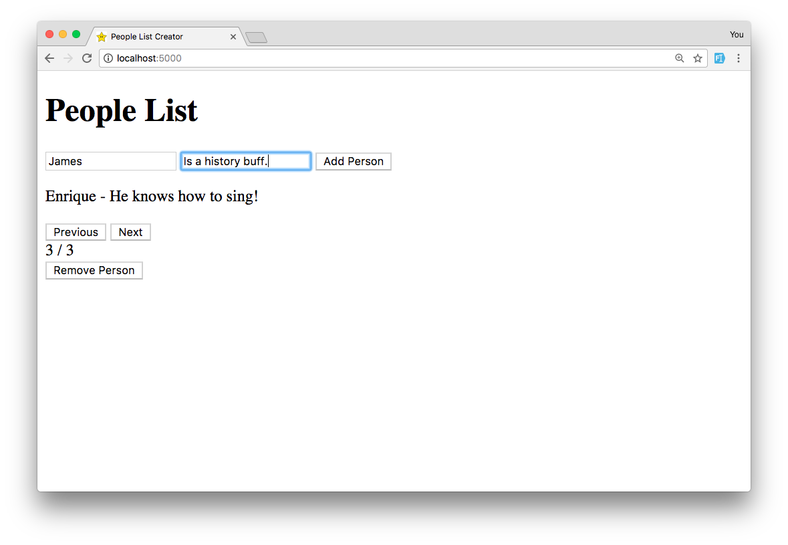
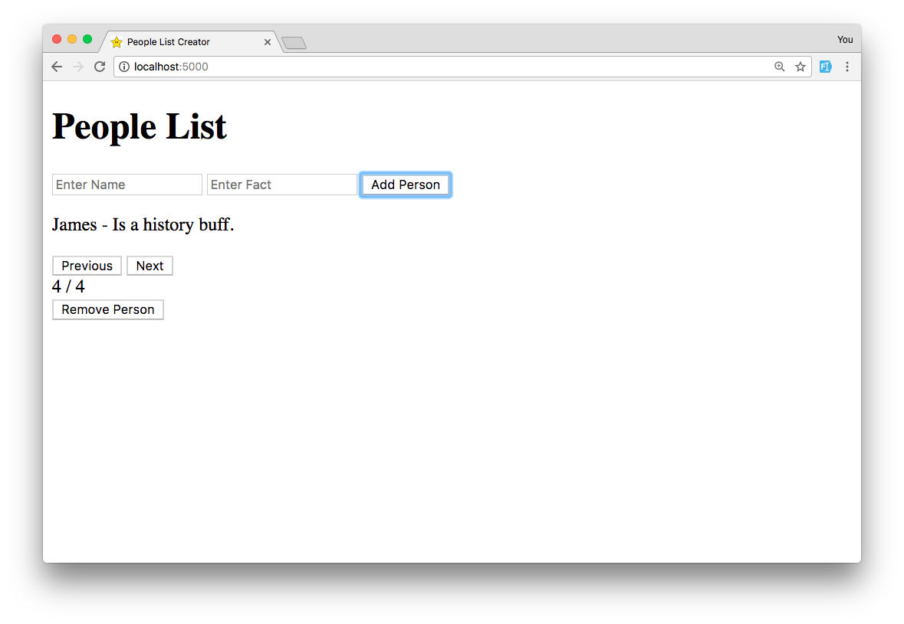

# People List Creator
jQuery based app allows user to create a list of people by entering their name and a corresponding trait, and adding them. Data is stored on a server, and the user can cycle through each person and trait using a carousel, and also can remove each person from the list.

<br>
<p>

</p>
<br>
<p>

</p>
<br>

## Built With
jQuery, JavaScript, HTML, CSS.

### Installing
Run ```npm install``` in terminal.

## Author
* Mike Pettman